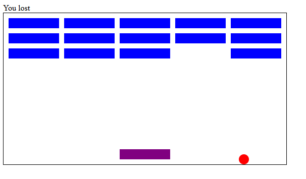
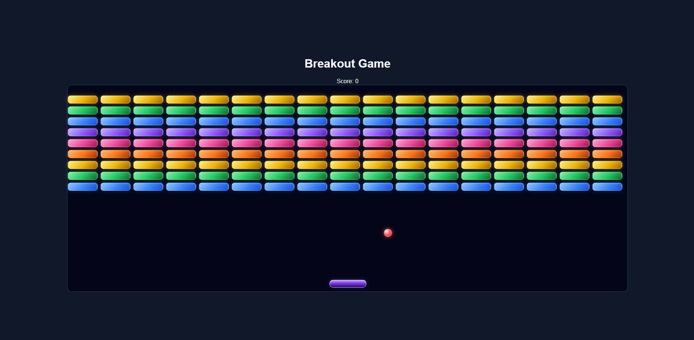

# Breakout Game

A simple browser-based Breakout game built with HTML, CSS, and vanilla JavaScript.

## Features
- Paddle controlled with keyboard arrows
- Ball movement and collision detection
- Score tracking
- Win / lose game states

## Tech Stack
- HTML
- CSS
- JavaScript

## How to Run
1. Clone the repository
2. Open `index.html` in your browser

## Learning Focus
This project demonstrates:
- DOM manipulation
- keyboard event handling
- basic game loop logic
- collision detection
- simple object-oriented structure with JavaScript classes

## Version_1 - Jun 21, 2022

## Version_2 - March 31, 2026

## Future Improvements
- Restart button
- Multiple levels
- Better ball bounce physics
- Mobile support
- Sound effects
